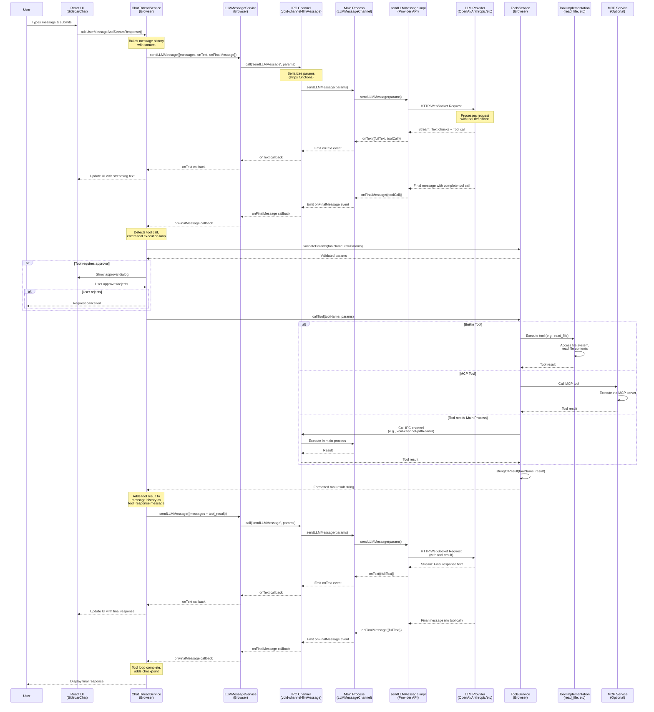
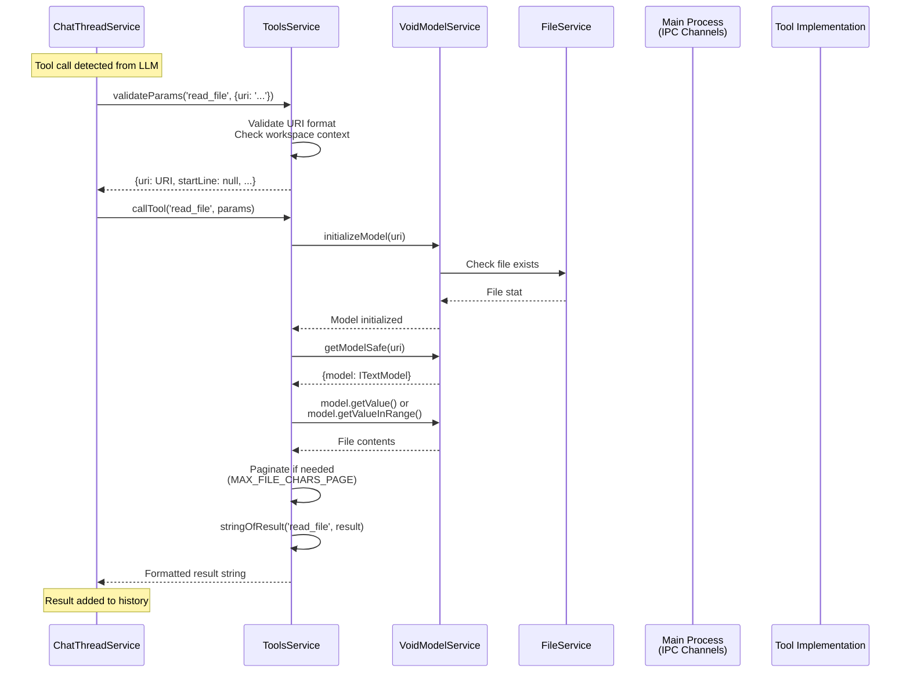
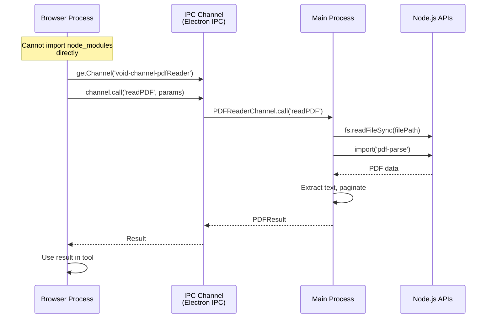
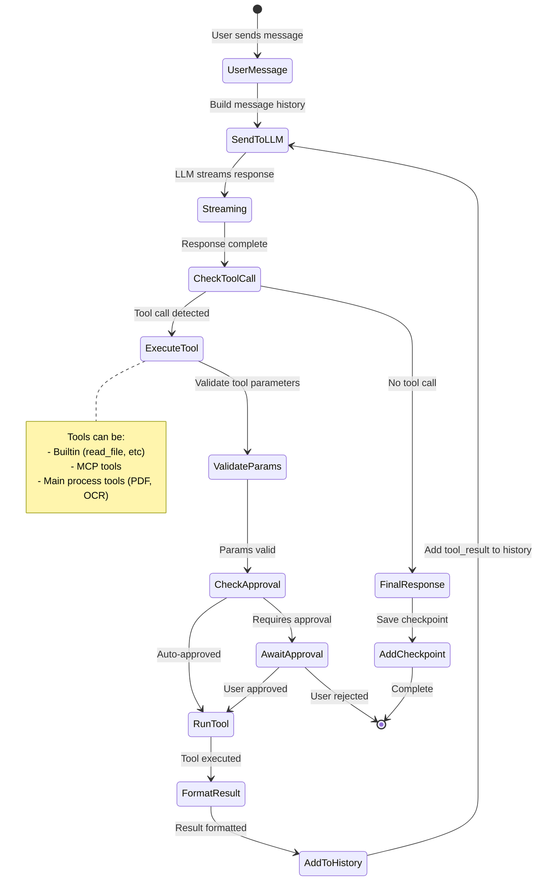
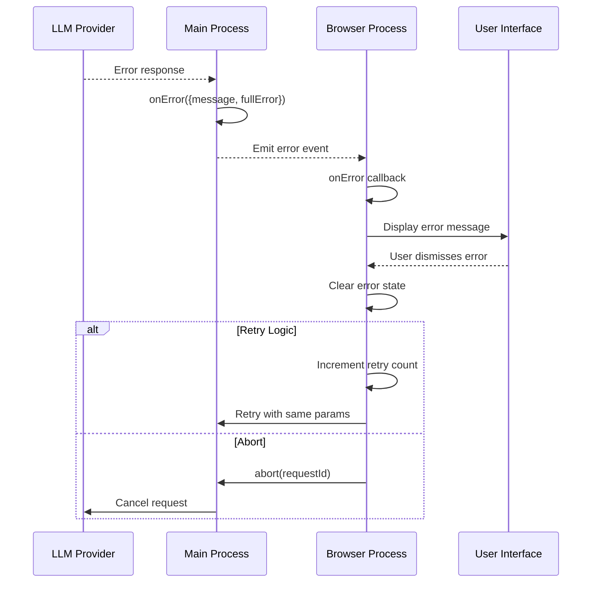

# Void Software - Time Step Diagram

This document illustrates the sequence of events when a user interacts with Void's AI assistant, showing the flow from user input through tool execution to final response.

## Complete Message Flow with Tool Call

## Tool Execution Flow (Detailed)

## IPC Channel Communication Pattern

## Multi-Tool Call Loop

## Error Handling Flow

