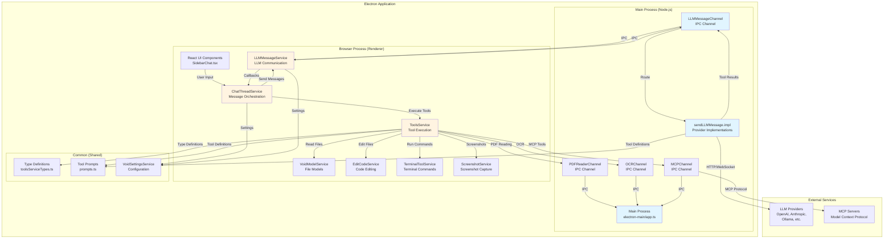
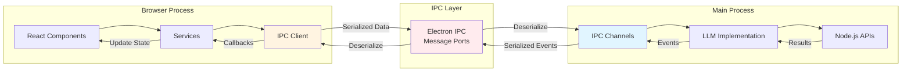
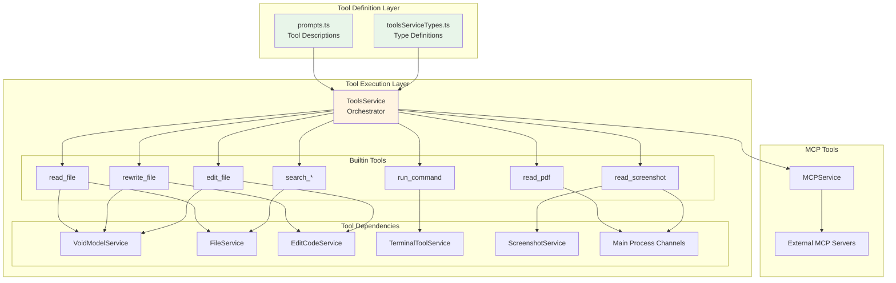
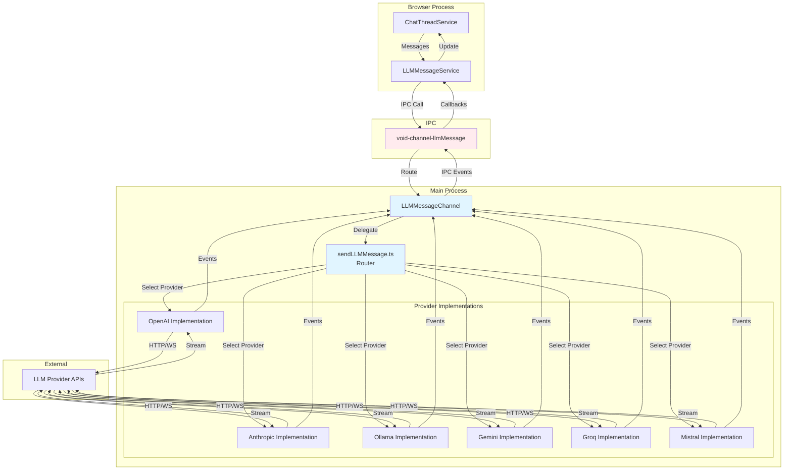
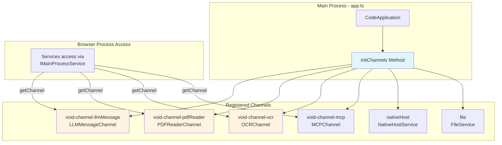
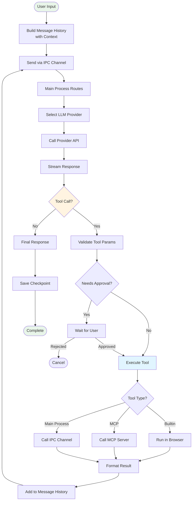
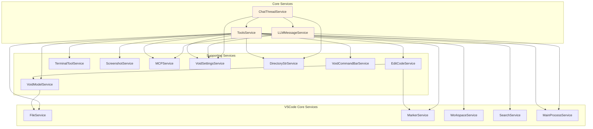

# Void Software - Wire Diagram

This document illustrates the architectural components of Void, their relationships, and data flow patterns.

## High-Level Architecture



## Process Communication Architecture



## Tool System Architecture



## LLM Communication Architecture



## File System and Model Management

```mermaid
graph TB
    subgraph "Browser Process"
        TS[ToolsService]
        VS[VoidModelService]
        ECS[EditCodeService]
    end

    subgraph "VSCode Services"
        FS[FileService<br/>VSCode Core]
        MS[MarkerService<br/>Linting]
        WS[WorkspaceService<br/>Context]
    end

    subgraph "Editor"
        Model[ITextModel<br/>File Model]
        Editor[ICodeEditor<br/>Editor Instance]
    end

    subgraph "File System"
        Files[Physical Files]
    end

    TS -->|Read| VS
    TS -->|Edit| ECS
    VS -->|Get/Create| Model
    VS -->|Read| FS
    ECS -->|Modify| Model
    ECS -->|Check| MS

    FS -->|Read/Write| Files
    Model -->|Sync| Editor
    Editor -->|Display| Model

    VS -->|Workspace Context| WS
    TS -->|Workspace Context| WS

    style VS fill:#fff4e1
    style ECS fill:#fff4e1
    style Model fill:#e8f5e9
```

## Main Process IPC Channels



## Data Flow: Complete Request Cycle



## Service Dependency Graph



